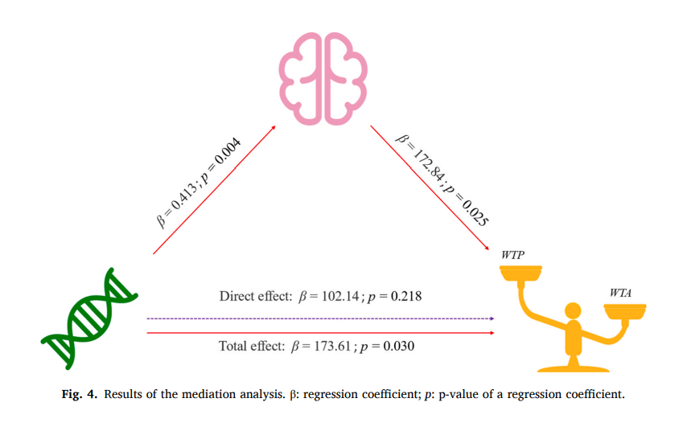
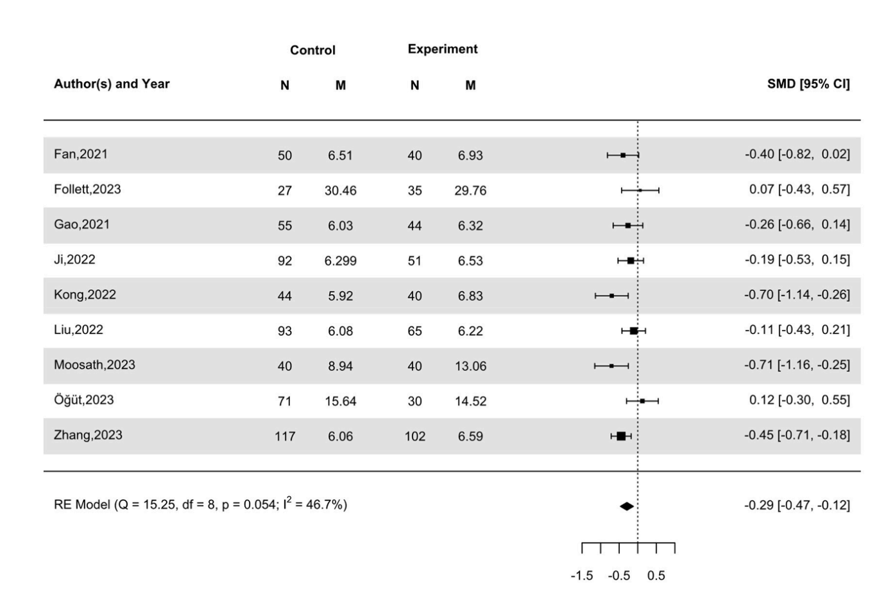
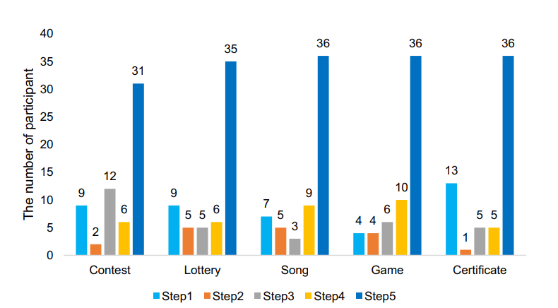
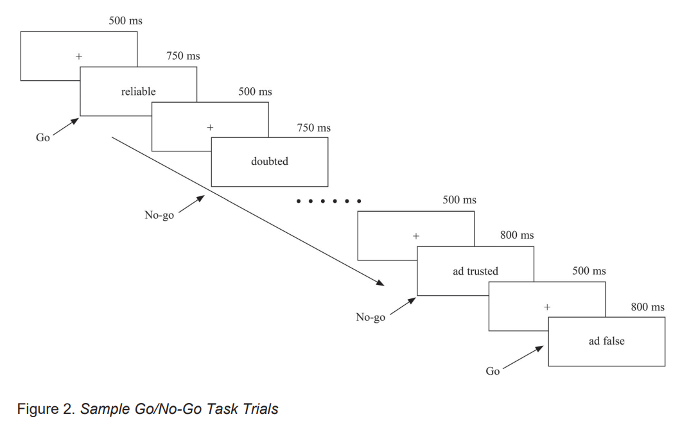

#  About me

My name is Tao Wang, and I am from Anhui. Under the guidance of [Assoc. Prof. Jianmin, Zeng](http://psy.swu.edu.cn/info/1035/1478.htm), I earned my Master's degree in [Psychology from Southwest University](http://psy.swu.edu.cn/#). Throughout my graduate studies, Professor Zeng's guidance was instrumental. I 
had the opportunity to collaborate with esteemed researchers such as [Weijie Huang](https://www.researchgate.net/profile/Weijie-Huang-9) and [Li Su](https://www.researchgate.net/profile/Li-Su-10), leading 
to our publication, "Right thalamic volume mediates impact of the dopamine beta-hydroxylase gene on the endowment effect" in the well-regarded journal, *Behavioural Brain Research* [JCR: **Q2**; CiteScore: **Q2**]. Additionally, I developed proficiency in advanced research techniques including meta-analysis, which enabled me to publish a paper titled "Social decision-making in major depressive disorder: A three-level meta-analysis", in the *Journal of Psychiatric Research* [JCR: **Q1**; CiteScore: **Q1**]."

**My research interest includes:**
- Decision-making
- Behavioural economics
- Neuroeconomics
- Mental disorders
- Meta-analysis

&nbsp;
&nbsp;

# 🔥 News
- 2025.04:  🎉🎉🎉 I'm pleased to share that my manuscript, "The Seller Cost Effect," has been accepted for publication in Experimental Psychology.
- 2025.01:  🎉🎉🎉 I was honored with the Scientific Achievement Award (10,000 RMB) by the Faculty of Psychology, Southwest University.
- *2024.08*: &nbsp;🎉🎉🎉 Tao Wang published an article as the first author in the ***Journal of Psychiatric Research*** (JCR:Q1; CiteScore: Q1). 
- *2024.07*: &nbsp;🎉🎉🎉 Tao Wang published an article as the first author in the ***Behavioural Brain Research*** (JCR:Q2; CiteScore: Q2).
- *2024.04*: &nbsp;🎉🎉🎉 Tao Wang published an article as the first author in the ***Journal of Affective Disorders Reports*** (CiteScore: Q2).

&nbsp;
&nbsp;

# 📝 Publications 

---

 

-	**Tao Wang**, Jianmin Zeng, Peiru Peng, & Qiao Yin. (2024). Social decision-making in major depressive disorder: A three-level meta-analysis. *Journal of Psychiatric Research*, 176, 293-303. 
[[HTML]](https://doi.org/https://doi.org/10.1016/j.jpsychires.2024.06.026)[[Preview]](https://github.com/wsanshi30/wsanshi30.github.io/blob/main/pdf/Wangt-2024-06.pdf) [[PDF]](/pdf/Wangt-2024-06.pdf)
&nbsp;
- **Journal Information**: CiteScore: 7.3 (Q1); IF: 3.7 (Q1)
- **Brief Introduction:** Major Depressive Disorder (MDD) is frequently associated with social dysfunction and impaired decision-making, but its impact on social decisions remains unclear. Our meta-analytic study reveals that MDD significantly impacts social decision-making, manifesting as reduced trust and increased cooperation, with these effects moderated by demographic and treatment variables. These findings emphasize the necessity for tailored therapeutic approaches that consider individual differences in age, education, and treatment coverage, to enhance social functionality and outcomes for MDD patients. 

 

-	**Tao Wang**, Jianmin Zeng, Weijie Huang, Xiong Xiong, & Li Su. (2024). Right thalamic volume mediates impact of the dopamine beta-hydroxylase gene on the endowment effect. *Behavioural Brain Research*, 469, 115050. 
[[HTML]](https://doi.org/https://doi.org/10.1016/j.bbr.2024.115050)[[Preview]](https://github.com/wsanshi30/wsanshi30.github.io/blob/main/pdf/WangT-2024-05.pdf) [[PDF]](/pdf/WangT-2024-05.pdf)
&nbsp;
- **Journal Information:** CiteScore: 5.6 (Q2); IF: 2.6 (Q2)
- **Brief Introduction:** Adaptive behavior in human through our live course is a direct result of the brain, but emerging evidence suggests that genes also introduce bias in behavior. Here, we showed that the interplay between thalamus and dopamine beta-hydroxylase gene jointly determined the endowment effect. Adaptive behavior in human through our live course is a direct result of the brain, but emerging evidence suggests that genes also introduce bias in behavior. Here, we showed that the interplay between thalamus and dopamine beta-hydroxylase gene jointly determined the endowment effect. 

 

-	**Tao Wang**, Jianmin Zeng, Yujie Yuan, Ying He, Jiayi Zhu, Beitong Lin, Qiao Yin, & Peiru Peng. (2024). Exploring the complex relationship between depression and risky decision-making: A meta-analysis. *Journal of Affective Disorders Reports*, 16, 100771.  
[[HTML]](https://doi.org/https://doi.org/10.1016/j.jadr.2024.100771)[[Preview]](https://github.com/wsanshi30/wsanshi30.github.io/blob/main/pdf/WangT-2024-04.pdf) [[PDF]](/pdf/WangT-2024-04.pdf)
- **Journal Information:** CiteScore: 3.8 (Q2)
- **Brief Introduction:** Individuals with Major Depressive Disorder (MDD) frequently engage in risky behaviors, such as self-harm and suicide, but its effect on risky economic decision-making remains unclear. Our study found that MDD patients perform differently across tasks: they select disadvantageous decks in the Iowa Gambling Task, make fewer pumps on the Balloon Analog Risk Task, and perform similarly to healthy controls in the Cambridge Gambling Task and the Game of Dice Task. These findings reveal how MDD influences economic decisions, highlighting the need for targeted interventions to mitigate risky behaviors. 

 

- Jianmin Zeng, Yujie Yuan, Ziyun Gao, Ying He, **Tao Wang**, & Jie Xu. (2023). The final step effect. *Judgment and Decision Making*, 18, e4.  
[[HTML]](https://doi.org/10.1017/jdm.2022.4)[[Preview]](https://github.com/wsanshi30/wsanshi30.github.io/blob/main/pdf/YuanYJ-2023-06.pdf) [[PDF]](/pdf/YuanYJ-2023-06.pdf)
- **Journal Information:** the official journal of the Society for Judgment and Decision Making (SJDM) and the European Association for Decision Making (EADM); CiteScore: 4.4 (Q2); IF: 1.9 (Q2);

 

- Jianmin Zeng, Ying He, Xing Ye, Tao Wang, & Ziyun Gao. (2023). The negative effect of advertisement signs on consumers' willingness to purchase. *Social Behavior and Personality: an international journal*, 51(12), e12288. 
[[HTML]](https://doi.org/10.2224/sbp.12288)[[Preview]](https://github.com/wsanshi30/wsanshi30.github.io/blob/main/pdf/HeY-2023-12.pdf) [[PDF]](/pdf/HeY-2023-12.pdf)
- Journal Information: IF: 2.2 (Q3); IF: 1 (Q4)
- Brief Introduction: Advertisements (ads) are intended to increase individuals' willingness to purchase and are usually expensive; thus, it would be counterproductive if an ad element actually decreased willingness to purchase. However, our study revealed that advertising signs on online shopping platforms decrease consumers' willingness to purchase, recommend, or click on products. These findings underscore the importance of understanding consumer psychology and suggest reevaluating the use of ad signs to avoid counterproductive effects in online advertising strategies. 

&nbsp;
&nbsp;       

# 💡 Skills
- Experienced in R programming:
  - Skilled in data manipulation using dplyr and tidyverse;
  - Experienced in data visualization with ggplot2;
  - Competent in statistical analysis and modeling with packages such as lm, glm, and lme4;
  - Knowledgeable in writing custom functions and scripts to automate data processing tasks;
  - Capable of using RMarkdown for reproducible research and dynamic reporting;

    In my academic research, R has been the primary tool for data analysis, enabling me to complete the data analysis and visualizations for my publications.

&nbsp;
&nbsp;

- Experienced in Meta-analysis:
  - Conducting systematic reviews and literature searches
  - Extracting and coding data from multiple studies
  - Applying statistical techniques to combine results using meta, metafor, and metaSEM packages
  - Assessing heterogeneity and publication bias
  - Creating forest plots, funnel plots, and other visualizations to present findings
  - Writing comprehensive reports and manuscripts detailing the methodology and results of meta-analyses

    In my published meta-analysis articles, both employed frequentist meta-analysis methods, with one specifically using a three-level meta-analysis. Additionally, I am currently utilizing Bayesian meta-analysis     for my upcoming research.

&nbsp;
&nbsp;

- Experienced in SPSS；
- Experienced in E-Prime;
- Experienced in Bibliometrics

&nbsp;
&nbsp; 

# 🏅 Honors and Awards
- 2022 Win the '1st Prize' of graduate scholoarship at Southwest University                                     
- 2017 Win National Encouragement Scholarship at Guangzhou University of Chinese Medicine                    
- 2017 Win First prize in the provincial comprehensive simulation competition of 2017 Learning Entrepreneurship Cup                                                                    

&nbsp;
&nbsp; 

# 🎓 Educations 
- *2020.09 - 2023.06*, [Faculty of Psychology, Southwest University](http://psy.swu.edu.cn/#), Chognqing China.
  - Degree: Master in Psychology (GPA: 4.02) [[Academic Records]](/pdf/GradEngRecords.pdf)                                                            Sep 2020 – July 2023
  - Relevant Coursework (score):
    Advances in Contemporary Psychology (95); Experimental Psychology (96); Meta-analysis Techniques (91); Advances in Social Cognitive Neuroscience Research (88);
    Statistics in Psychology and Education (83)

- *2014.09 - 2018.06*, [School of Public Health and Management, Guangzhou University of Chinese Medicine](https://sphm.gzucm.edu.cn/ggwsyglen/), Guangzhou China.
  - Degree: B.A. in Management (GPA: 3.52) [[Academic Records]](/pdf/BechlorChiRecords.pdf)                                                              Sep 2014 – July 2018
  - Relevant Coursework (score):
    International Marketing (90.2); Services Marketing (90); Sales Management (94); Customer Relationship Management (93); Organizational Behavior (87.4); Advertising (90);
    Introduction to Western Medicine (91.5)

- *2011.09 - 2014.06*, [Bozhou No. 1 High School](https://www.bzyzh.com/),Bozhou China.

# self-introduction

- Name: Wang Tao
- Major: Fundamental Psychology
- Degree: Master’s in Decision Science
- Graduated from: Southwest University
- Technical Skills: R, Meta-Analysis, EEG, fMRI
- Research Interests: 
  - Decision-Making and Behavioral Economics 
  - Neuroeconomics
  - Meta-Analysis
  - Mental Health and Disorders

# 🔥 News

- *2025.04*: &nbsp;🎉🎉🎉 I'm pleased to share that my manuscript, "The Seller Cost Effect," has been accepted for publication in Experimental Psychology.
- *2025.01*: &nbsp;🎉🎉🎉 I was honored with the Scientific Achievement Award (10,000 RMB) by the Faculty of Psychology, Southwest University.
- *2024.08*: &nbsp;🎉🎉🎉 I published an article as the first author in the Journal of Psychiatric Research (JCR:Q1; CiteScore: Q1). 
- *2024.07*: &nbsp;🎉🎉🎉 I published an article as the first author in the Behavioural Brain Research (JCR:Q2; CiteScore: Q2).
- *2024.04*: &nbsp;🎉🎉🎉 I published an article as the first author in the Journal of Affective Disorders Reports (CiteScore: Q2).

# 📝 Publications
1. **Tao Wang**, Lixin Tan, Jianmin Zeng, & Yujie Yuan. (2025). The Seller Cost Effect. Experimental Psychology, 72(1), 14-26. [[HTML]](https://doi.org/10.1027/1618-3169/a000640)[[PDF]](/pdf/wangt-2025-05.pdf) SSCI (Q4)
2.  **Tao Wang**, Jianmin Zeng, Peiru Peng, & Qiao Yin. (2024). Social decision-making in major depressive disorder: A three-level meta-analysis. Journal of Psychiatric Research, 176, 293-303. [[HTML]](https://doi.org/https://doi.org/10.1016/j.jpsychires.2024.06.026)[[PDF]](/pdf/Wangt-2024-06.pdf) SSCI (Q1)
3.  **Tao Wang**, Jianmin Zeng, Weijie Huang, Xiong Xiong, & Li Su. (2024). Right thalamic volume mediates impact of the dopamine beta-hydroxylase gene on the endowment effect. *Behavioural Brain Research*, 469, 115050. [[HTML]](https://doi.org/https://doi.org/10.1016/j.bbr.2024.115050)[[PDF]](/pdf/WangT-2024-05.pdf) SSCI (Q2)
4.  **Tao Wang**, Jianmin Zeng, Yujie Yuan, Ying He, Jiayi Zhu, Beitong Lin, Qiao Yin, & Peiru Peng. (2024). Exploring the complex relationship between depression and risky decision-making: A meta-analysis. *Journal of Affective Disorders Reports*, 16, 100771.  [[HTML]](https://doi.org/https://doi.org/10.1016/j.jadr.2024.100771)[[PDF]](/pdf/WangT-2024-04.pdf)
5.  Jianmin Zeng, Yujie Yuan, Ziyun Gao, Ying He, **Tao Wang**, & Jie Xu. (2023). The final step effect. *Judgment and Decision Making*, 18, e4.  [[HTML]](https://doi.org/10.1017/jdm.2022.4)[[PDF]](/pdf/YuanYJ-2023-06.pdf) SSCI (Q2)
6.  Jianmin Zeng, Ying He, Xing Ye, **Tao Wang**, & Ziyun Gao. (2023). The negative effect of advertisement signs on consumers' willingness to purchase. *Social Behavior and Personality: an international journal*, 51(12), e12288. [[HTML]](https://doi.org/10.2224/sbp.12288)[[PDF]](/pdf/HeY-2023-12.pdf) SSCI (Q4)

